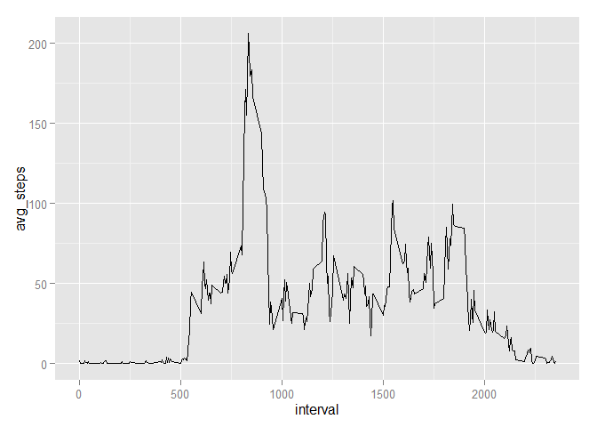

# Reproducible Research: Peer Assessment 1


## Loading and preprocessing the data

```r
# load some useful libraries
library(dplyr, warn.conflicts = FALSE)
library(ggplot2, warn.conflicts = FALSE)
library(lubridate, warn.conflicts = FALSE)

# download, unzip and load the data
temp <- paste(getwd(), '/dataActivity.zip', sep="")
download.file("https://d396qusza40orc.cloudfront.net/repdata%2Fdata%2Factivity.zip",temp,method = "wininet")
data <- read.csv(unz(temp, "activity.csv"))
unlink(temp)
```

## What is mean total number of steps taken per day?

```r
# group the data by day ignoring NA values
data.by.day <- group_by(filter(data, !is.na(steps)), date)
# count the number of steps by day
steps.by.day <- summarise(data.by.day, steps = sum(steps))
# histogram of the total number of steps taken each day
p <- ggplot(data=steps.by.day, aes(steps.by.day$steps)) + geom_histogram()
suppressMessages(print(p))
```

 

```r
# calculate the mean total number of steps taken per day
mean.steps.per.day <-  mean(steps.by.day$steps) 
# calculate the median total number of steps taken per day
median.steps.per.day <-  median(steps.by.day$steps)
```
The mean total number of steps taken per day is 10766.19, and the median steps taken per day is 10765


## What is the average daily activity pattern?

```r
# group the data by interval
data.by.interval <- group_by(data, interval)
# count the number of steps by interval and also calculate the mean of each interval
steps.by.interval <- summarise(data.by.interval , total_steps = sum(steps, na.rm = TRUE), avg_steps = mean(steps, na.rm = TRUE))
# time series plot of the 5-minute interval (x-axis) and the average number of steps taken, averaged across all days (y-axis)
ggplot(data=steps.by.interval, aes(x=interval, y=avg_steps)) + geom_line()
```

 

```r
# 5-minute interval, on average across all the days in the dataset, that contains the maximum number of steps
interval.with.maximum.number.steps <- arrange(steps.by.interval, desc(avg_steps))[1, "interval"]
```
The 5-minute interval, on average across all the days in the dataset, that contains the maximum number of steps is the interval # 835


## Imputing missing values

```r
# Calculate and report the total number of missing values in the dataset (i.e. the total number of rows with NAs)
number.NA <- nrow(data[is.na(data$steps), ])
# Create a new dataset that is equal to the original dataset but with the missing data filled in. What I do is get the mean of that interval with NA step value and replace it with that value
data.without.NA <- rbind (data[!is.na(data$steps), ], rename(select(merge( data[is.na(data$steps), ],steps.by.interval, by="interval"    ), c(avg_steps, date, interval)), steps = avg_steps  ) )
# group the data by day
data.by.day.without.NA <- group_by(data.without.NA, date)
# count the number of steps by day
steps.by.day.without.NA <- summarise(data.by.day.without.NA, steps = sum(steps))
# histogram of the total number of steps taken each day
p <- ggplot(data=steps.by.day.without.NA, aes(steps)) + geom_histogram()
suppressMessages(print(p))
```

 

```r
# calculate the mean total number of steps taken per day for the non-NA dataset
mean.steps.per.day.without.NA <-  mean(steps.by.day.without.NA$steps) 
# calculate the median total number of steps taken per day for the non-NA dataset
median.steps.per.day.without.NA <-  median(steps.by.day.without.NA$steps)
```
There are 2304 NA values in the original data set.

The mean total number of steps taken per day is without NA values is 10766.19 (original value was 10766.19), and the median steps taken per day is 10766.19 (original value was 10765)


## Are there differences in activity patterns between weekdays and weekends?

```r
# factor variable in the dataset with two levels - "weekday" and "weekend" indicating whether a given date is a weekday or weekend day.
data.without.NA <- mutate(data.without.NA,  day_type = as.factor(ifelse(wday(as.Date(date))==1 | wday(as.Date(date))==7 ,"weekend","weekday")) )
# group the data by interval
data.by.dayType.and.interval.without.NA <- group_by(data.without.NA, day_type, interval)
# count the number of steps by interval and also calculate the mean of each interval
steps.by.dayType.and.interval.without.NA <- summarise(data.by.dayType.and.interval.without.NA , total_steps = sum(steps), avg_steps = mean(steps))
# time series plot of the 5-minute interval (x-axis) and the average number of steps taken, averaged across all days (y-axis)
ggplot(data=steps.by.dayType.and.interval.without.NA, aes(x=interval, y=avg_steps)) + geom_line() + facet_grid(day_type  ~ . )
```

 
